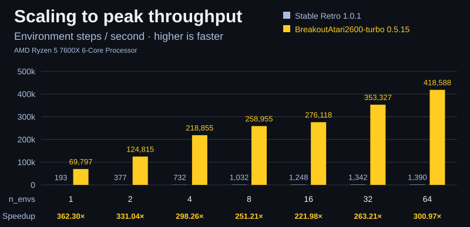

<p align="center">
  
  <br />
  <!-- repo-tagline:start -->
  <strong>🕹️ Reproducible Breakout for parallel RL experiments ⚡</strong>
  <!-- repo-tagline:end -->
</p>

<p align="center">
  <a href="https://github.com/tsilva/env-BreakoutAtari2600-turbo-native/actions/workflows/ci.yml"></a>
  <a href="https://pypi.org/project/env-breakoutatari2600-turbo-native/"></a>
  <a href="https://github.com/tsilva/env-BreakoutAtari2600-turbo-native/blob/main/pyproject.toml"></a>
  <a href="https://github.com/tsilva/env-BreakoutAtari2600-turbo-native/blob/main/LICENSE"></a>
</p>

**env-BreakoutAtari2600-turbo-native** implements Atari 2600 Breakout in Rust
with a Python [Gymnasium] interface. Policies trained here should work in
[Stable Retro] when both environments use the same observation, action, and
episode settings within the
[documented compatibility contract](https://github.com/tsilva/env-BreakoutAtari2600-turbo-native/blob/main/docs/environment.md).
Native gameplay, parallel execution, and preprocessing are designed
to make environment stepping orders of magnitude faster than emulator-based
environments such as [Stable Retro].

<p align="center">
  <a href="https://github.com/tsilva/env-BreakoutAtari2600-turbo-native/blob/showcase-v0.5.15-20261005-style5/demo.mp4">
    
  </a>
</p>

<p align="center">
  
</p>

[Benchmark results, method, and proof](benchmarks.md).

## Quick start

Requires Python 3.11+ on Apple-silicon macOS 11+ or x86-64 Linux with glibc 2.28+.
Playing needs no ROM, emulator, or Rust installation.

With [uv](https://docs.astral.sh/uv/) installed, create a project and open the
interactive player:

```bash
uv init --python 3.11 breakout-experiment
cd breakout-experiment
uv add "env-breakoutatari2600-turbo-native[play]"
uv run env-breakoutatari2600-turbo-native play
```

Move with ←/→ or A/D, press Space to serve, and Escape to quit. Press P to
pause or R to restart. Add `--uncapped` to play without a display-rate limit,
or `--help` to see all player options.

For an existing project, skip `uv init` and `cd`. If you only need the Python
API, install without the optional player: `uv add env-breakoutatari2600-turbo-native`.

## Train an agent

Train a PPO agent with the published [GradLab](https://github.com/tsilva/gradlab)
recipes. Training lives in GradLab, separately from this environment. Run either
version-pinned recipe from any directory:

```bash
# Standard PPO
uvx gradlab@0.1.1 train Breakout-Atari2600-v0/ppo

# PPO with learning-rate decay and KL-based update stopping
uvx gradlab@0.1.1 train Breakout-Atari2600-v0/ppo-stable-updates
```

These are full training runs. GradLab saves `final_model.zip` under `./runs`
and prints a version-pinned playback command when training finishes or stops safely. Run that
command to watch your trained policy play. Local runs disable W&B and checkpoint
evaluation by default.

## Use from Python

Save this as `quickstart.py` in your project, then run `uv run python quickstart.py`:

```python
import gymnasium as gym
import numpy as np

env = gym.make_vec(
    "env_breakoutatari2600_turbo_native:EnvBreakoutAtari2600TurboNative-v0",
    game="Breakout-Atari2600-v0",
    num_envs=16,
    num_threads=4,
)

try:
    obs, infos = env.reset(seed=42)
    actions = np.ones(env.num_envs, dtype=np.uint8)  # FIRE in every game
    obs, rewards, terminated, truncated, infos = env.step(actions)
    print(obs.shape)  # (16, 4, 84, 84)
finally:
    env.close()
```

This starts 16 independent games and serves the ball in each. Observations
contain four stacked 84×84 grayscale frames per game. Each step advances four
native game frames by default.

See the [full rollout example](https://github.com/tsilva/env-BreakoutAtari2600-turbo-native/blob/main/examples/quickstart.py)
for a longer loop with selective resets and a local throughput measurement.

## Extra info variables

The stock [Stable Retro 1.0.1 Breakout integration](https://github.com/Farama-Foundation/Stable-Retro/blob/v1.0.1/stable_retro/data/stable/Breakout-Atari2600-v0/data.json)
exposes `score` and `lives`. Native adds the fields below. **Default** means
included with the default `info_filter="all"`; **opt-in** means explicitly
selected through `info_filter`. Reset metadata is returned on reset regardless
of that filter.

| Extra info key(s) | Meaning | Availability |
| --- | --- | --- |
| `paddle_x`, `paddle_x_normalized` | Paddle's left edge; raw position uses fixed-point pixels. | Raw: default; normalized: opt-in |
| `paddle_vx`, `paddle_vx_normalized` | Signed paddle displacement during the latest native frame, including inertia and edge clamping. | Opt-in |
| `ball_x`, `ball_x_normalized` | Ball's horizontal position; raw position uses fixed-point pixels. | Raw: default; normalized: opt-in |
| `ball_y`, `ball_y_normalized` | Atari RAM vertical coordinate; zero while waiting for FIRE. | Raw: default; normalized: opt-in |
| `ball_screen_y`, `ball_screen_y_normalized` | Ball's simulation vertical position in fixed-point pixels, without the waiting-for-FIRE sentinel. | Opt-in |
| `ball_vx`, `ball_vx_normalized` | Signed horizontal ball velocity in fixed-point pixels per native frame. | Raw: default; normalized: opt-in |
| `ball_vy`, `ball_vy_normalized` | Signed vertical ball velocity in fixed-point pixels per native frame. | Raw: default; normalized: opt-in |
| `paddle_width`, `paddle_width_normalized` | Paddle width: initially 16 pixels, narrowing to 12 after ceiling contact. | Opt-in |
| `ball_paddle_offset`, `ball_paddle_offset_normalized` | Signed distance from paddle center to ball center; raw distance uses fixed-point pixels. | Opt-in |
| `score_normalized` | Score divided by the selected layout's two-wall maximum. | Opt-in |
| `lives_normalized` | Remaining lives divided by five. | Opt-in |
| `brick_mask`, `brick_mask_high` | Logical brick occupancy split into low 64 and high 44 bits. | Default |
| `bricks_remaining`, `bricks_remaining_normalized` | Remaining logical bricks in the current wall. | Raw: default; normalized: opt-in |
| `bricks_destroyed`, `bricks_destroyed_normalized` | Cumulative brick removals across both walls. | Opt-in |
| `walls_cleared`, `walls_cleared_normalized` | Completed walls, from zero to two. | Raw: default; normalized: opt-in |
| `brick_grid` | Visible brick occupancy as a 6×18 matrix of zeros and ones; can differ from the logical count during startup. | Opt-in |
| `is_initial_brick_layout` | Whether the episode is still in its initial layout animation, before native frame 36. | Opt-in |
| `serve_phase` | Hidden serve phase: `0..3` while waiting for FIRE, `-1` during active play. | Opt-in |
| `tick` | Elapsed native frames in the episode. | Default |
| `layout_id` | Native layout identifier, `0..3`. | Default |
| `collision_events` | Latest native frame's collision bitmask: wall `1`, paddle `2`, brick `4`, life loss `8`. | Default |
| `pending_reset` | Whether the lane has terminated and requires a reset. | Default |
| `state_index` | Current layout's index in the configured state catalog. | Reset only |
| `start_source` | Reset source: `0` for a catalog state, `1` for a restored snapshot. | Reset only |
| `noop_reset_count` | Raw-frame noops applied to a static reset; its presence mask is false for snapshot restores. | Reset only |

Vector infos are arrays with a leading environment dimension. Each key has a
Boolean presence mask named `_<key>`; check it before using a lane's value,
especially after selective resets. Fixed-point values use 65,536 units per
pixel. Normalized values are `float32` and are not clipped.

Select the policy-oriented fields, including their raw/normalized pairs, with:

```python
from env_breakoutatari2600_turbo_native import BreakoutVecEnv, POLICY_INFO_KEYS

env = BreakoutVecEnv(
    "Breakout-Atari2600-v0",
    info_filter={"mode": "all", "keys": POLICY_INFO_KEYS},
)
```

An explicit `keys` selection replaces the default signal selection. See
[info filtering and normalization](docs/environment.md#info-filtering) for
divisors, shapes, validity, and ownership; `env.signal_schema` and
`env.signal_metadata` describe the selected fields programmatically.

## Important behavior

- **Serve each ball:** actions are `0` noop, `1` FIRE, `2` right, and `3` left.
- **Reset completed games:** autoreset is disabled. Reset terminal lanes before
  stepping again; a Boolean `reset_mask` leaves other games unchanged. See the
  [reset example](https://github.com/tsilva/env-BreakoutAtari2600-turbo-native/blob/main/docs/environment.md#manual-reset).
- **Keep observations safely:** default observations reuse two rotating buffers.
  Use `obs_copy="copy"` when retaining observations across environment calls.
- **Understand rewards:** rewards are score changes, without life-loss or
  board-clear shaping. Episodes end after all five lives are lost; the
  environment does not generate truncation.

## Documentation and contributing

- [Environment reference](https://github.com/tsilva/env-BreakoutAtari2600-turbo-native/blob/main/docs/environment.md):
  actions, preprocessing, rendering, snapshots, branching, game signals,
  [Stable Retro Turbo] compatibility, and the optional Stable-Baselines3 adapter.
- [Performance comparison](https://github.com/tsilva/env-BreakoutAtari2600-turbo-native/blob/main/benchmarks.md)
  and [release validation](https://github.com/tsilva/env-BreakoutAtari2600-turbo-native/blob/main/docs/release-validation.md):
  timing methodology, parity evidence, validation limits, and evidence ownership.
- [Contributing](https://github.com/tsilva/env-BreakoutAtari2600-turbo-native/blob/main/CONTRIBUTING.md):
  source setup, development commands, and tests.
- [Support](https://github.com/tsilva/env-BreakoutAtari2600-turbo-native/blob/main/SUPPORT.md)
  and [changelog](https://github.com/tsilva/env-BreakoutAtari2600-turbo-native/releases):
  installation help, supported platforms, and changes during the `0.x` community preview.

## Architecture


## License

[MIT](https://github.com/tsilva/env-BreakoutAtari2600-turbo-native/blob/main/LICENSE).
See [third-party notices](https://github.com/tsilva/env-BreakoutAtari2600-turbo-native/blob/main/THIRD_PARTY_NOTICES.md)
for Atari, [Stable Retro], ROM, and trademark boundaries.

[Gymnasium]: https://gymnasium.farama.org/
[Stable Retro]: https://stable-retro.farama.org/
[Stable Retro Turbo]: https://github.com/tsilva/env-StableRetro-turbo
